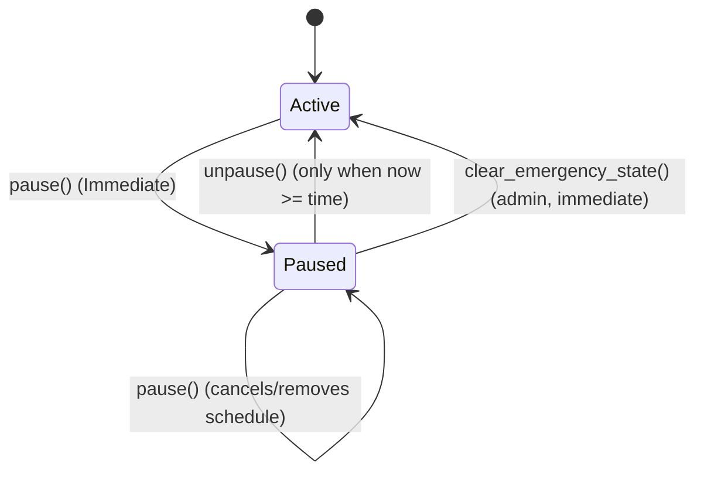

# Emergency Killswitch: Unpause Timelock Design

## Overview
To prevent rapid-cycle oscillations (rapidly enabling/disabling the pause state) and accidental premature unpauses by administrators during incidents, the `emergency_killswitch` contract implements an **Unpause Timelock**. 

When a critical system incident occurs, an operator immediately pauses the contract to protect user funds. Once the incident is resolved, a mandatory cooling-off window is enforced before the system can be unpaused. This gives operators, auditors, and monitoring systems sufficient time to verify the fix and prepare for normal operations.

---

## Timelock Architecture

The timelock architecture relies on the following contract endpoints and state invariants:

### 1. State Representation (`DataKey`)
The scheduling state is stored within the contract instance storage using the `DataKey` enum:
- `DataKey::UnpauseSchedule`: Stores the future unpause timestamp (`u64`). If no unpause is scheduled, this key is not present.
- `DataKey::GlobalPaused`: Represents whether the global contract functionality is currently paused (`bool`).

### 2. Actions & Invariants

#### A. Global Pause (`pause`)
- **Action**: Halt all contract operations immediately.
- **Invariant**: Any call to `pause()` automatically cancels and removes any pending schedule stored in `DataKey::UnpauseSchedule`. This ensures that if the system is re-paused during an incident, an old scheduled unpause cannot be used to bypass the cooling-off window.

#### B. Schedule Unpause (`schedule_unpause`)
- **Action**: Register a future timestamp for when the system is eligible to be unpaused.
- **Invariant**: The scheduled time must be in the future relative to the current ledger timestamp. The contract rejects any past-dated schedules (`time < env.ledger().timestamp()`) with an `Error::InvalidSchedule`. This prevents bypassing the timelock with a past timestamp.

#### C. Unpause (`unpause`)
- **Action**: Lift the global pause state and return the contract to active status.
- **Invariant**: The unpause action cannot take effect before the scheduled time. The `unpause()` function enforces `env.ledger().timestamp() >= scheduled_time` using the value stored under `DataKey::UnpauseSchedule`. If no schedule is active, `unpause()` fails with `Error::InvalidSchedule`.

#### D. Read-Only Query (`is_paused`)
- **Action**: Returns the current pause status.
- **Invariant**: The return value of `is_paused()` remains `true` throughout the incident and the cooling-off window. It only returns `false` *after* the `unpause()` function has been successfully executed by the admin after the timelock expires.

#### E. Emergency Recovery (`clear_emergency_state`)
- **Action**: Admin-only escape hatch that lifts the global pause **immediately**, bypassing the timelock.
- **Why it exists**: The timelock can leave the contract in a *stuck-paused* state with no usable recovery short of redeploying. Because `pause()` removes any pending `DataKey::UnpauseSchedule` (invariant A), a re-pause during an incident leaves `GlobalPaused = true` with no schedule, so `unpause()` fails with `Error::InvalidSchedule` no matter how far the ledger advances. An operator who scheduled an unpause far in the future by mistake is similarly stuck until that timestamp.
- **Behaviour**: Sets `DataKey::GlobalPaused` to `false` and removes any pending `DataKey::UnpauseSchedule` in a single call. It is **idempotent** — calling it while the contract is active is a successful no-op.
- **Scope**: Clears only the *global* pause. Module-level (`pause_module`) and function-level (`pause_function`) pauses are intentionally preserved; lift those with `unpause_module` / `unpause_function`.
- **Authorization**: Requires the killswitch admin (`admin.require_auth()`); returns `Error::NotInitialized` if the contract has no admin set.
- **Trade-off**: This deliberately bypasses the cooling-off window. The timelock still governs the normal `schedule_unpause` → `unpause` path; `clear_emergency_state` is the break-glass recovery reserved for the admin when the normal path is unusable.
- **Event**: Emits `("emergency", "cleared")` with `("GLOBAL", timestamp)`.

---

## Error Codes
- `Error::Unauthorized` (1): Returned when the caller is not the admin, or if `unpause()` is called before the scheduled timelock expires.
- `Error::InvalidSchedule` (5): Returned when `schedule_unpause()` is called with a past-dated timestamp, or when `unpause()` is called without a valid scheduled time.

### E. Pause Precedence and Scope
The `emergency_killswitch` implements layered pause scopes with the following precedence:
- `pause()` (global pause) dominates all module and function pause state.
- `pause_module(module)` pauses every function in the named module.
- `pause_function(module, fn)` pauses an individual function only.

`is_function_paused(env, module, fn)` returns `true` when any of these conditions are met:
1. The contract is globally paused.
2. The module is paused.
3. The function is individually paused.

Module-level pause is a blanket override but does not clear per-function pause flags. After `unpause_module(module)`, each function returns to its prior individual state:
- Functions explicitly paused before or during a module pause remain paused.
- Functions that were not individually paused before the module pause return to unpaused.

These semantics are verified by unit tests in `emergency_killswitch/tests/test_killswitch.rs`.

---

## Security Verification and Testing
All invariants are verified by robust unit tests in `emergency_killswitch/tests/test_killswitch.rs`:
1. **`test_premature_unpause_rejection`**: Verifies that calling `unpause()` before the scheduled timestamp fails with `Error::Unauthorized`.
2. **`test_re_pause_cancels_schedule`**: Verifies that calling `pause()` cancels any pending unpause schedule, causing subsequent `unpause()` calls to fail with `Error::InvalidSchedule` even if the ledger moves past the originally scheduled timestamp.
3. **`test_timelock_bypass_rejection`**: Verifies that past-dated schedules are immediately rejected by `schedule_unpause()`.
4. **Boundary conditions**: Validates that unpause is successful exactly at the boundary of the scheduled timestamp (`ledger.timestamp() == scheduled_time`).
5. **`test_clear_emergency_state_recovers_stuck_pause`**: Verifies that `clear_emergency_state()` lifts the global pause from the stuck state produced by a re-pause (where `unpause()` fails with `Error::InvalidSchedule`).
6. **`test_clear_emergency_state_bypasses_timelock`**: Verifies that `clear_emergency_state()` succeeds before a scheduled unpause time and wipes the pending schedule.
7. **`test_clear_emergency_state_is_idempotent_when_active`**: Verifies that calling `clear_emergency_state()` on an unpaused contract is a successful no-op.
8. **`test_clear_emergency_state_requires_initialization`**: Verifies that `clear_emergency_state()` returns `Error::NotInitialized` before an admin is set.
9. **`test_clear_emergency_state_requires_admin_auth`**: Verifies that `clear_emergency_state()` rejects callers that are not the admin.
10. **`test_clear_emergency_state_preserves_module_and_function_pauses`**: Verifies that the recovery clears only the global pause and leaves module- and function-level pauses intact.
